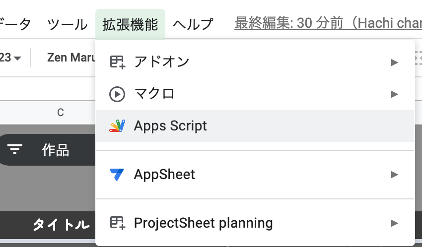
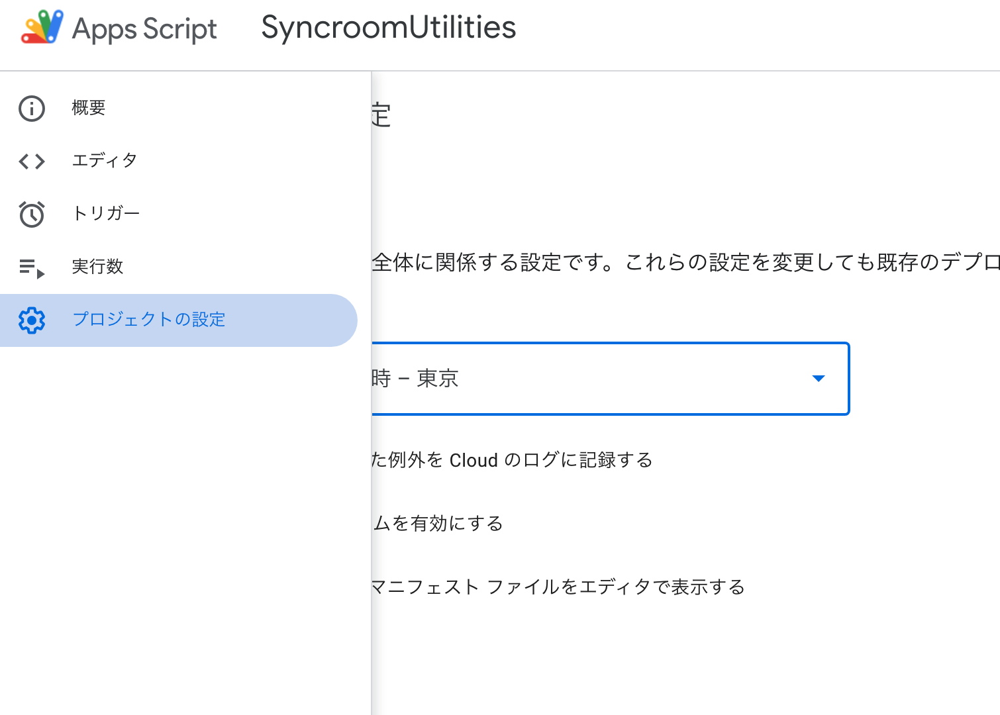
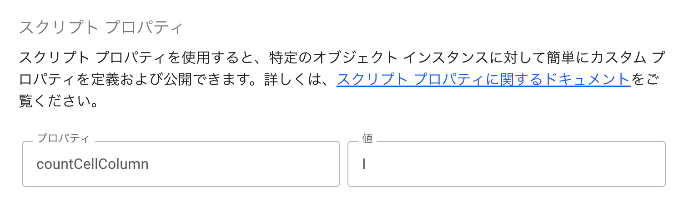
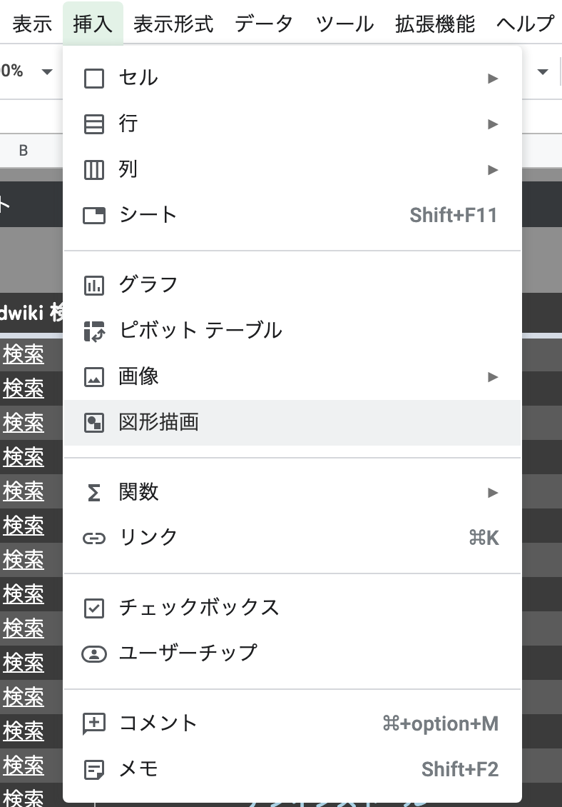
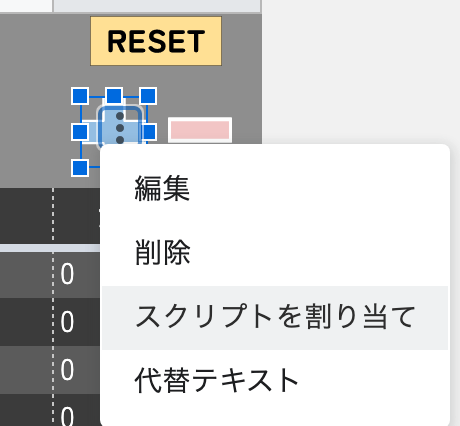

## 概要

Google Spreadsheet で曲目を管理する人用の演奏回数カウントをマウスだけでやるためのアレです。

## 仕様

- 0 未満にはなりません
- 空セルは 0 とみなします
- 10 分で書いたスクリプトなのであんまりテストしてません(小数点とか)
- 現在選択しているセルの行のカウンタ用セルを見つけて書き込みます

## 設定の仕方

まず曲目シートを開き、`拡張機能 > App Script`をクリックします。


スクリプトエディタが開くので、最初から書いてあるスクリプトを消します。

[このスクリプト](https://github.com/fuyunekojima/syncroom_setlist_counter/blob/main/main.gs)をすべて貼り付けて保存します。

画面左の歯車アイコンをクリックして設定を開きます。


スクリプトプロパティの設定をします。

ここでは自分のシートでどの列に演奏回数を書き込むのかをスクリプトに教えるための設定をします。



以下のように設定します。

```
プロパティ: countCellColumn
値: 自分のシート上で書き込みたい列のアルファベット
```

設定できたら自分のシートに戻り、`挿入 > 図形描画`を選択します。


なんかいい感じに図形を作って保存します。

図形の作り方は調べればいくらでも出てくるので頑張ってください。

図形は加算・減算・リセット用の３つ分作ってください。

図形ができたらいい塩梅に配置します。

配置したら図形を右クリックすると、・が３つ縦に並んだボタンがでるのでクリックします。

スクリプトを割り当てをクリックします。



どのスクリプトを割り当てるか聞いてくるので以下のように設定します。

```
加算用図形: increment
減算用図形: decrement
リセット用図形: reset
```

これらを設定すると図形はボタンになり、左クリックでスクリプトが走るようになります。

図形の編集がしたい場合は図形を右クリックしてください。

## 使い方

数値を変えたい曲の行のどこでもいいのでセルを選択しておきます。
設定した図形をクリックすると値が変わります。

## バグ・要望について

[ここ](https://github.com/fuyunekojima/syncroom_setlist_counter/issues)に書き込んでください。

知り合いは僕に直接言ってくれてもよい。
